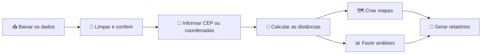

# 🌱 Guia divertido do Sampa+Rural

## O projeto explicado em uma frase

Você informa um lugar — por **CEP** ou **latitude e longitude** — e o projeto procura os aparelhos do Sampa+Rural mais próximos, desenha mapas e prepara tabelas e relatórios para pesquisa.

Pense nele como um GPS acadêmico para responder:

> “Quais aparelhos do Sampa+Rural estão perto deste lugar e o que significa estar perto?”

---

## 🧭 A viagem completa



O projeto faz sete coisas principais:

1. baixa os dados públicos;
2. guarda uma cópia com data e checksum;
3. verifica problemas como coordenadas ausentes;
4. transforma CEPs em coordenadas;
5. calcula diferentes tipos de distância;
6. cria mapas e análises estatísticas;
7. gera arquivos que podem ser usados na pesquisa.

---

## 🎒 O que você precisa

Antes de começar, tenha:

- R instalado;
- conexão com a internet para baixar dados e consultar CEPs;
- autorização para a coleta automatizada;
- um contato real para identificar o projeto;
- opcionalmente, um arquivo do OpenStreetMap para calcular caminhos pelas ruas.

Você **não precisa saber programar muito** para testar a aplicação. Os comandos principais já estão prontos.

---

## 🚀 Primeiro passeio: abrir a aplicação demonstrativa

Abra o terminal dentro da pasta do projeto e execute:

```bash
Rscript -e 'renv::restore()'
Rscript scripts/run_app.R
```

Depois, abra no navegador o endereço apresentado pelo R, normalmente parecido com:

```text
http://127.0.0.1:3838
```

### O que acontece nesse modo?

A aplicação usa 12 pontos inventados para demonstração. Uma faixa amarela avisa que os dados são sintéticos.

Esse modo serve para:

- conhecer as telas;
- testar CEP ou coordenadas;
- aprender a ler o resultado;
- verificar se a instalação está funcionando.

⚠️ **Não use os dados demonstrativos em uma dissertação ou artigo.**

---

## 📥 Como baixar os dados verdadeiros

### Passo 1 — Identifique sua pesquisa

Abra o arquivo [`config.yml`](config.yml) e localize:

```yaml
user_agent: "sampamaisrural-academic/0.1.0 (contato: pesquisa@example.org)"
```

Troque `pesquisa@example.org` pelo seu contato real. Por exemplo:

```yaml
user_agent: "sampamaisrural-academic/0.1.0 (contato: pesquisador@universidade.br)"
```

O coletor não funciona com o endereço de exemplo. Isso é proposital: o servidor público precisa saber quem está fazendo a coleta.

### Passo 2 — Confirme a autorização

No mesmo arquivo, confirme:

```yaml
collection:
  authorized: true
```

Use `true` somente se a autorização continuar válida.

### Passo 3 — Execute a coleta

```bash
Rscript scripts/update_data.R
```

O projeto vai:

- consultar o catálogo do Sampa+Rural;
- baixar os relatórios JSON e CSV;
- esperar entre as requisições;
- tentar novamente quando houver uma falha temporária;
- calcular checksums;
- normalizar a base completa;
- separar registros com problemas espaciais.

### Onde ficam os arquivos?

```text
data/
├── raw/          ← cópia original, organizada por data
├── processed/    ← base limpa para análise
├── cache/        ← respostas de CEP já consultadas
└── osm/          ← lugar sugerido para arquivos OpenStreetMap
```

Os dados originais não são substituídos. Cada data de coleta funciona como uma fotografia do portal naquele momento.

---

## 🧹 O que significa “limpar os dados”?

Imagine uma caixa de frutas. Antes de fazer a feira, precisamos separar:

- frutas prontas para uso;
- frutas sem etiqueta;
- frutas com informação incompleta;
- frutas que foram colocadas na caixa errada.

O projeto faz algo parecido com as coordenadas:

| Situação | O que significa | O que o projeto faz |
|---|---|---|
| Coordenada válida | O ponto pode ser colocado no mapa | Entra nos cálculos |
| Coordenada ausente | Latitude e longitude não existem | Vai para quarentena |
| Coordenada incompleta | Só latitude ou só longitude | Vai para quarentena |
| Coordenada inválida | Valor impossível, como latitude 95 | Vai para quarentena |
| Fora da área | Ponto distante da área configurada | Vai para quarentena |

“Quarentena” não significa apagar. O registro continua contado no relatório de qualidade, mas não participa de um cálculo espacial que produziria resultado enganoso.

---

## 📍 Como informar um lugar

Existem duas opções.

### Opção A — Latitude e longitude

Exemplo do centro de São Paulo:

```text
Latitude:  -23.5505
Longitude: -46.6333
```

Essa costuma ser a opção mais precisa quando as coordenadas foram obtidas de uma fonte confiável.

### Opção B — CEP

Exemplo:

```text
01001-000
```

O projeto consulta a BrasilAPI e guarda a resposta em cache. Se o mesmo CEP aparecer outra vez, não é necessário repetir a consulta externa.

⚠️ Um CEP representa uma área ou um ponto de referência. Ele não deve ser interpretado automaticamente como a posição exata de uma residência.

### Regra de ouro

Em uma mesma linha, informe:

- **CEP**, ou
- **latitude e longitude**.

Não informe as duas opções ao mesmo tempo.

---

## 📏 Por que existem tantas distâncias?

Porque “perto” pode ter significados diferentes.

Imagine que você e um amigo estão separados por um rio:

- em linha reta, vocês parecem próximos;
- caminhando até uma ponte, o caminho pode ser longo;
- de carro, uma rua de mão única pode obrigar uma volta;
- de bicicleta, uma via pode ser permitida ou proibida.

Por isso, o projeto não escolhe escondido uma única resposta.

### Distâncias geométricas

| Distância | Analogia simples | Uso principal |
|---|---|---|
| Karney | Uma fita métrica acompanhando a forma elipsoidal da Terra | Principal distância geodésica |
| Haversine | Uma fita sobre uma Terra perfeitamente redonda | Comparação com uma aproximação esférica |
| Euclidiana | Uma régua reta sobre um mapa plano | Separação direta no sistema projetado |
| Manhattan | Andar por quarteirões, somente horizontal e vertical | Cenário de grade ortogonal |
| Chebyshev | Um rei do xadrez que pode andar também na diagonal | Cenário geométrico com movimento diagonal |

Karney e Haversine usam longitude e latitude. Euclidiana, Manhattan e Chebyshev usam o sistema métrico **SIRGAS 2000 / UTM 23S — EPSG:31983**.

### Distâncias pela rede de ruas

Quando os grafos OpenStreetMap estão disponíveis, o projeto calcula:

| Modo | Caminho mais curto | Caminho mais rápido |
|---|---:|---:|
| 🚶 Caminhada | Sim | Sim |
| 🚲 Bicicleta | Sim | Sim |
| 🚗 Automóvel | Sim | Sim |

O caminho mais curto reduz os metros percorridos. O caminho mais rápido reduz o tempo estimado. Eles podem escolher ruas diferentes.

### Ida e volta podem ser diferentes

Em redes com mão única ou restrições:

```text
origem → aparelho
```

pode ser diferente de:

```text
aparelho → origem
```

Na aplicação, escolha “Ambos” para calcular os dois sentidos.

---

## 🛣️ Como ativar as distâncias pelas ruas

Sem um arquivo de rede, as cinco distâncias geométricas continuam funcionando.

Para ativar caminhada, bicicleta e automóvel, obtenha um arquivo `.osm.pbf` com a região de São Paulo. Guarde a data, o endereço de origem e a licença do arquivo.

Depois execute:

```bash
Rscript scripts/prepare_network.R data/osm/sao-paulo.osm.pbf limite-municipal.gpkg
```

O segundo arquivo é o limite espacial e é opcional. Sem ele:

```bash
Rscript scripts/prepare_network.R data/osm/sao-paulo.osm.pbf
```

Serão criados:

```text
data/processed/network_foot.rds
data/processed/network_bicycle.rds
data/processed/network_motorcar.rds
```

### O que é snapping?

Snapping é ligar um ponto à rede de ruas.

```text
📍 ponto informado  ·····  🛣️ rua
                    ↑
              distância de snapping
```

- Até 250 metros: uso normal.
- Acima de 250 metros: o resultado recebe um alerta.
- Acima de 1.000 metros: o par é excluído da rota.
- Sem caminho possível: o par recebe o estado `unreachable`.

Esses valores estão em `config.yml` e podem ser usados em análises de sensibilidade.

---

## 🖥️ Conhecendo a aplicação

### Aba “Consulta”

É o lugar para uma consulta individual.

1. escolha coordenadas ou CEP;
2. informe a origem;
3. escolha categorias, se desejar;
4. defina o número de vizinhos;
5. defina o raio;
6. escolha os modos de rede;
7. escolha o sentido;
8. clique em **Calcular proximidade**.

O mapa permite trocar a métrica exibida. A tabela pode ser filtrada e o resultado pode ser baixado em CSV.

### Aba “Lotes”

Recebe arquivos com várias origens. O trabalho entra em uma fila para não travar a aplicação.

### Aba “Estatísticas”

Mostra cobertura por categoria e concordância entre as métricas da consulta.

### Aba “Qualidade”

Mostra quantos registros possuem coordenadas úteis e quais problemas foram encontrados.

### Aba “Metodologia”

Resume as definições, limitações e cuidados éticos.

---

## 📦 Consultando muitas origens

### Arquivo por coordenadas

Crie `origens.csv`:

```csv
query_id,latitude,longitude,k,radius_m
escola_1,-23.5505,-46.6333,10,5000
escola_2,-23.6200,-46.7000,20,3000
```

### Arquivo por CEP

```csv
query_id,cep,k,radius_m
local_1,01001000,10,5000
local_2,01310100,15,3000
```

### Significado das colunas

| Coluna | Tradução |
|---|---|
| `query_id` | Nome único criado por você para a origem |
| `cep` | CEP com oito dígitos |
| `latitude` | Posição norte/sul |
| `longitude` | Posição leste/oeste |
| `k` | Quantos vizinhos mais próximos procurar |
| `radius_m` | Raio de procura em metros |

O limite padrão da aplicação web é de 100 mil linhas.

### Executando pelo terminal

```bash
Rscript scripts/batch.R \
  --input=origens.csv \
  --output=outputs/meu-lote \
  --modes=foot,bicycle,motorcar \
  --direction=both
```

### Executando pela aplicação

1. abra a aba **Lotes**;
2. escolha o arquivo;
3. clique em **Adicionar à fila**;
4. deixe o worker funcionando em outro terminal:

```bash
Rscript scripts/worker.R
```

5. acompanhe o estado do lote;
6. informe o ID de um lote concluído;
7. baixe o arquivo ZIP.

### Estados de um lote

```text
queued → running → completed
                   ↘ failed
```

Em português:

- `queued`: esperando na fila;
- `running`: sendo processado;
- `completed`: concluído;
- `failed`: ocorreu uma falha.

O processamento usa blocos e checkpoints. Se o worker parar, o trabalho pode continuar dos blocos já concluídos.

---

## 🔍 Como ler o resultado

Cada linha representa:

```text
uma origem × um aparelho × uma métrica × um sentido
```

Campos importantes:

| Campo | Pergunta respondida |
|---|---|
| `origin_id` | De qual origem estamos falando? |
| `equipment_name` | Qual é o aparelho? |
| `category` | A qual categoria pertence? |
| `metric_id` | Qual régua foi usada? |
| `direction` | Foi ida, volta ou distância simétrica? |
| `distance_m` | Quantos metros? |
| `duration_min` | Quantos minutos estimados? |
| `rank` | É o primeiro, segundo ou terceiro mais próximo? |
| `within_radius` | Está dentro do raio escolhido? |
| `routing_status` | A rota funcionou ou recebeu alerta? |

O resultado guarda a união de:

- aparelhos dentro do raio; e
- os `k` aparelhos mais próximos de cada métrica.

Assim, um aparelho pode aparecer mesmo estando fora do raio, caso ainda esteja entre os `k` mais próximos.

---

## 🗺️ Criando mapas em R

```r
library(sampamaisrural)

config <- read_sampa_config()
aparelhos <- load_equipment_data(config)

origem <- data.frame(
  query_id = "centro",
  latitude = -23.5505,
  longitude = -46.6333,
  k = 10,
  radius_m = 5000
)

resultado <- calculate_proximity(
  origins = origem,
  equipment = aparelhos,
  graphs = load_network_graphs(config),
  directions = "both",
  config = config
)

create_interactive_map(resultado)
create_static_map(resultado)
```

O primeiro mapa é interativo. O segundo é um objeto `ggplot2`, adequado para personalização e figuras acadêmicas.

---

## 📊 Estatística sem sustos

### Concordância entre métricas

```r
metric_agreement(resultado, k = 10)
```

O projeto calcula:

- Spearman e Kendall: verificam se as métricas ordenam os aparelhos de forma parecida;
- Jaccard top-k: verifica quanto as listas de vizinhos se sobrepõem;
- Bland–Altman: mostra diferenças entre pares de distâncias.

Nenhuma métrica é tratada automaticamente como verdade absoluta.

### Grade hexagonal

```r
grade <- create_hex_grid(aparelhos, cell_size_m = 2000)
```

É como cobrir o mapa com uma colmeia e contar quantos aparelhos caem em cada célula.

### Modelo de contagem

```r
modelo <- fit_spatial_count_model(grade)
modelo$selected_family
modelo$dispersion
modelo$moran
```

O projeto compara Poisson e binomial negativa, examina sobredispersão e tenta calcular Moran para os resíduos.

⚠️ O modelo é exploratório e associacional. Encontrar uma associação não prova causalidade.

---

## 📄 Criando relatórios

```r
render_proximity_report(
  results = resultado,
  output_file = "outputs/relatorio.html",
  equipment = aparelhos,
  config = config
)
```

Para PDF:

```r
render_proximity_report(
  results = resultado,
  output_file = "outputs/relatorio.pdf",
  equipment = aparelhos,
  config = config
)
```

O relatório inclui:

- proveniência;
- resumo das distâncias;
- curva de distribuição;
- concordância entre métricas;
- tabela detalhada;
- limitações;
- orientações de reprodutibilidade.

---

## 🔬 Cuidados para o mestrado

Antes de olhar os resultados principais, escreva suas escolhas:

- Qual é a população estudada?
- Qual snapshot será usado?
- Quais categorias entram?
- Qual é a distância principal?
- Qual será o raio?
- Quantos vizinhos serão considerados?
- A análise usa caminhada, bicicleta ou automóvel?
- O sentido é ida, volta ou ambos?
- Qual é a unidade territorial?
- Quais análises são confirmatórias e quais são exploratórias?

Leia o [`PROTOCOL.md`](PROTOCOL.md) para o plano científico completo.

### Quatro armadilhas comuns

1. **Cadastro incompleto:** ausência no mapa não significa ausência no território.
2. **CEP aproximado:** não representa necessariamente um endereço exato.
3. **Rede desatualizada:** o OpenStreetMap muda com o tempo.
4. **Correlação não é causa:** proximidade pode estar relacionada a renda, densidade, uso do solo e outras variáveis.

---

## 🔐 Privacidade e ética

- Não publique coordenadas individuais das origens.
- Não envie arquivos sensíveis para repositórios públicos.
- Telefones, e-mails e redes sociais da fonte não entram na base analítica.
- Prefira mapas agregados para divulgação.
- Mantenha `data/`, `jobs/` e `outputs/` fora do Git.
- Registre quem pode acessar snapshots brutos.
- Apague lotes quando terminar o prazo de retenção.

O ZIP de um lote concluído não inclui o arquivo original de origens.

---

## 🧪 Como verificar se tudo está saudável

### Testes automatizados

```bash
Rscript -e 'testthat::test_local()'
```

### Verificação completa do pacote

```bash
R CMD check --no-manual .
```

### Teste rápido no R

```r
library(sampamaisrural)
nrow(demo_equipment())
```

O resultado esperado é:

```text
12
```

---

## 🧯 Problemas comuns

### “Substitua o contato de exemplo”

Edite o `user_agent` em `config.yml` e informe um contato institucional real.

### “Nenhum snapshot processado encontrado”

Execute:

```bash
Rscript scripts/update_data.R
```

### A aplicação mostra “Modo demonstração”

Os dados oficiais ainda não foram processados ou não foram encontrados em `data/processed/`.

### As distâncias de rede não aparecem

Prepare o arquivo OpenStreetMap com `scripts/prepare_network.R` e reinicie a aplicação.

### Um CEP não possui coordenadas

Alguns CEPs podem não ser encontrados ou podem não trazer uma coordenada utilizável. Consulte o arquivo de erros do lote.

### O lote ficou em `queued`

Inicie o worker:

```bash
Rscript scripts/worker.R
```

### O lote ficou em `failed`

Leia a mensagem da fila e `validation_errors.csv`. Corrija o arquivo de entrada e envie um novo lote.

---

## 🗂️ Mapa da pasta do projeto

```text
sampamaisrual/
├── R/                    ← funções do pacote
├── scripts/              ← comandos prontos
├── tests/                ← testes automáticos
├── inst/reports/         ← modelo do relatório
├── inst/app/             ← textos e estilo da aplicação
├── data/                 ← dados locais, fora do Git
├── jobs/                 ← fila e arquivos temporários
├── outputs/              ← mapas e relatórios
├── config.yml            ← configurações do pesquisador
├── _targets.R            ← pipeline reprodutível
├── renv.lock             ← versões dos pacotes
├── PROTOCOL.md           ← protocolo científico
├── CODEBOOK.md           ← dicionário de dados
└── README.md              ← apresentação técnica
```

---

## 📚 Minidicionário

| Palavra | Explicação simples |
|---|---|
| API | Porta organizada para um sistema entregar dados |
| Cache | Gaveta que guarda uma resposta para reutilização |
| Checksum | Impressão digital de um arquivo |
| CRS | Regra usada para representar posições no mapa |
| Grafo | Conjunto de ruas e cruzamentos usado no roteamento |
| Manifesto | Lista do que foi baixado ou produzido |
| Parquet | Formato compacto e rápido para tabelas grandes |
| Quarentena | Lugar para registros problemáticos sem apagá-los |
| Snapshot | Fotografia dos dados em uma data |
| Snapping | Ligação de um ponto à rede de ruas |
| Worker | Processo que retira trabalhos da fila e os executa |

---

## ✅ Checklist do primeiro resultado real

- [ ] Li a autorização de coleta.
- [ ] Troquei o contato de exemplo em `config.yml`.
- [ ] Executei `renv::restore()`.
- [ ] Executei `scripts/update_data.R`.
- [ ] Conferi o relatório de qualidade.
- [ ] Registrei a data do snapshot.
- [ ] Preparei o OpenStreetMap, caso use distâncias de rede.
- [ ] Defini `k`, raio, modo e sentido antes da análise principal.
- [ ] Testei uma origem conhecida.
- [ ] Documentei limitações e análises de sensibilidade.
- [ ] Evitei publicar origens individuais.
- [ ] Gerei e arquivei o manifesto e o relatório.

---

## 🌿 Resumo final

Se você lembrar apenas de quatro coisas, lembre destas:

1. **CEP e coordenada não têm a mesma precisão.**
2. **Distância em linha reta e caminho pelas ruas respondem a perguntas diferentes.**
3. **Dados ausentes continuam importantes para avaliar a qualidade da pesquisa.**
4. **Um mapa mostra padrões, mas sozinho não demonstra causalidade.**

Agora o caminho mais simples é:

```text
restaurar pacotes → baixar dados → conferir qualidade → preparar rede → abrir aplicação
```

Boa pesquisa! 🌱🗺️📊
