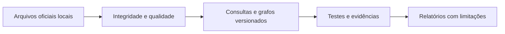

# Validação com dados reais — SampaMaisAgro 🌱

Ficha de conferência da versão 0.2, executada em 15/09/2026. Complementa o
[guia de uso](../GUIA_LUDICO.md) e o [protocolo acadêmico](../PROTOCOL.md).
Não certifica completude do cadastro ou acessibilidade física.

## 1. A despensa está abastecida?

Sim. O snapshot `20260914T011240Z` contém o catálogo e os **14 relatórios em CSV e
JSON**: 29 arquivos de fonte, além dos manifestos. O relatório de pontos de doação
está presente, mas vazio na fonte. Contagens e SHA-256 estão registrados em
`data/processed/inventory.csv` e nos manifestos de `data/raw/`.

O relatório completo tinha 4.238 registros. A consolidação removeu 71 repetições
exatas, chegando a **4.167 perfis distintos por conteúdo**. Os relatórios temáticos
foram conciliados com a base completa, sem somar novamente os mesmos perfis.

- 3.321 registros são elegíveis para análise espacial.
- 844 não têm coordenadas; não foram inventadas localizações para eles.
- 2 ficam fora do retângulo de estudo configurado.
- 17 registros elegíveis estão fora da malha municipal simplificada do IBGE,
  mas dentro do retângulo. O campo `within_municipality` identifica isso.

O cadastro não é um censo: perfis diferentes podem descrever a mesma instalação.

| Grupo solicitado | Perfis cadastrados | Mapeáveis |
|---|---:|---:|
| Feiras livres | 903 | 903 |
| Feiras orgânicas | 37 | 37 |
| Hortifrutis e sacolões | 4 | 4 |
| Abastecimento / CEASA / CEAGESP | 3 | 3 |
| Alimentos e comércio de orgânicos | 148 | 135 |
| Hortas urbanas e institucionais | 1.975 | 1.906 |
| Agricultores e produção rural | 875 | 68 |
| Comércio e alimentação | 1.189 | 1.182 |
| Apoio à agricultura e políticas públicas | 240 | 240 |
| Vivência rural e aldeias | 184 | 116 |
| Outros registros da fonte | 6 | 6 |

**Não some as linhas:** os grupos se sobrepõem. Três perfis ligados a abastecimento
não representam um inventário de toda a CEAGESP. A baixa cobertura de coordenadas
de agricultores é uma limitação importante para comparações territoriais.

## 2. O CEP que falhava agora funciona?

Sim: `05586-001`, ponto aproximado `-23.571872, -46.730196`, armazenado localmente
com resposta JSON e proveniência AwesomeAPI. Não representa um domicílio exato.

Com raio de 5 km e k = 10:

- Karney seleciona **240 registros**, todos dentro do raio.
- A união das cinco métricas geométricas seleciona 288 perfis.
- O CSV contém 1.180 combinações de origem, perfil e métrica; não são 1.180 lugares.

| Perfil | Distância geodésica aproximada |
|---|---:|
| Horta pedagógica CEI Maria Tereza de Macedo Costa | 131,6 m |
| Horta Caminhos do Iquiririm | 236,1 m |
| Secos e Molhados | 284,6 m |
| Rede de Viveiros PANC | 304,5 m |
| Feira Vila Indiana | 318,5 m |

Esses números podem mudar com atualização das fontes, filtros ou origem.

## 3. O que foi efetivamente testado?

| Verificação | Resultado |
|---|---|
| Testes unitários | 77 verificações aprovadas, zero falhas, avisos ou testes pulados |
| `R CMD check` | `Status: OK` |
| Interface com CEP e coordenadas reais | Aprovada |
| Mapa inicial, mapa da consulta e estatísticas | Aprovados |
| Exportação CSV, HTML e ZIP de lote | Aprovada |
| Lote misto | Duas origens válidas; um CEP ausente explicado por linha |
| Requisições externas do navegador | Zero; conexões externas bloqueadas no teste |
| Erros JavaScript no teste completo | Zero |
| Paginação do PDF | Revisada visualmente; tabelas longas e gráficos sem cortes |
| Redes atuais de caminhada, bicicleta e carro | Aprovadas: menor distância e menor tempo, ida e volta |
| Caminhada pela interface | Aprovada: sete métricas, mapa, CSV e diagnóstico; zero chamadas externas e erros JavaScript |

O teste negativo usa um CEP ausente no índice. A aplicação deve explicar como
prepará-lo e limpar os resultados antigos; não deve aproveitar outra coordenada.

A auditoria detectou uma checagem antiga que aceitava ausência de versão no grafo.
Ela foi corrigida: o teste agora exige explicitamente a política `v2` e o hash da
fonte viária. Evidências de rede anteriores a essa correção não são a validação final.

A consolidação final terminou em **15/09/2026, 20:32:16 UTC** (17:32:16 em São
Paulo), com `passed: true` e **11 métricas**. O teste de caminhada na interface
selecionou 19 registros por menor distância no raio de 1 km; o mais próximo ficou
a aproximadamente 208,6 m pela rede, incluindo os conectores estimados.

### Tempo de espera observado ⏳

| Execução | Tempo observado |
|---|---:|
| Caminhada, ida e volta, duas funções de custo, sem leitura do grafo | 182,9 s |
| Bicicleta, mesmas condições | 167,9 s |
| Carro, mesmas condições | 122,8 s |
| Consulta a pé na interface, somente ida, incluindo leitura do grafo | 183,4 s |

Não é um benchmark controlado: havia tarefas concorrentes nesta máquina. Os tempos
dependem de hardware, base, modos e número de origens. As cinco métricas geométricas
são mais leves; ative os modos de rede somente quando necessários. Não interprete
a espera de alguns minutos na rede como ausência de resultados.

## 4. Onde estão as provas?

- [Teste reproduzível com a base real](../scripts/validate_real_data.R).
- [Teste completo de navegador](../tests/e2e/test_app.py).
- [Teste lento de caminhada no navegador](../tests/e2e/test_network.py).
- `outputs/test-artifacts/browser-evidence.json`: teste da interface.
- `outputs/test-artifacts/real-cep.png`: captura do CEP com mapa e indicadores.
- `outputs/test-artifacts/real-batch-map.png`: resultado do lote.
- `outputs/test-artifacts/walking-browser-evidence.json`: teste aprovado da caminhada.
- `outputs/test-artifacts/real-walking.png`: mapa e tabela da caminhada.
- `outputs/validation-real/evidence.json`: consolidação das onze métricas.
- `outputs/validation-real/all-distances.csv`: resultados geométricos e de rede.
- `outputs/validation-real/routing-diagnostics.csv`: rotas antes da seleção.
- `outputs/validation-real/relatorio-real.html`: relatório da análise real.
- `outputs/reports/cep-05586001-real.pdf`: relatório paginado do CEP, raio de 1 km.
- `sampamaisrural.Rcheck/00check.log`: verificação do pacote.

Os artefatos são locais e não acompanham automaticamente o código no GitHub.
Confira `passed: true` e a data em `evidence.json`: a existência de um relatório
antigo, sozinha, não significa que a execução atual terminou.

## 5. O que ainda exige cuidado no mestrado?

O extrato OSM tem 331.135 vias e informa data-base de 24/07/2026. A data de download
não deve ser confundida com a data dos dados. Vias, restrições e horários podem mudar.
Os mapas são vetoriais e locais; mostram os equipamentos, não os traçados dos trajetos.

As redes modelam menor distância e menor tempo, com ida e volta. Não incorporam
trânsito real, todas as restrições de conversão, barreiras em calçadas ou auditoria
de acessibilidade. Os conectores até os vértices são estimativas retilíneas.

Medianas, quantis e curvas descrevem os pares selecionados por raio **ou** top-k.
Spearman/Kendall comparam rankings; nas rotas mais rápidas, o ranking é por tempo.
As diferenças pareadas permanecem em metros. Nenhuma dessas medidas prova
acesso efetivo da população, segurança alimentar ou efeito causal.

Novos CEPs precisam ser preparados com internet antes do uso offline. Para uma
origem com coordenadas conhecidas, não é necessário geocodificar um CEP.

## 6. Estado da retomada

A implementação e os testes acima estão concluídos localmente. As alterações
preexistentes em `renv/activate.R` foram preservadas. Não foi feito novo commit
ou push nesta retomada. Os arquivos históricos de demonstração não substituem
as evidências reais identificadas nesta ficha.
