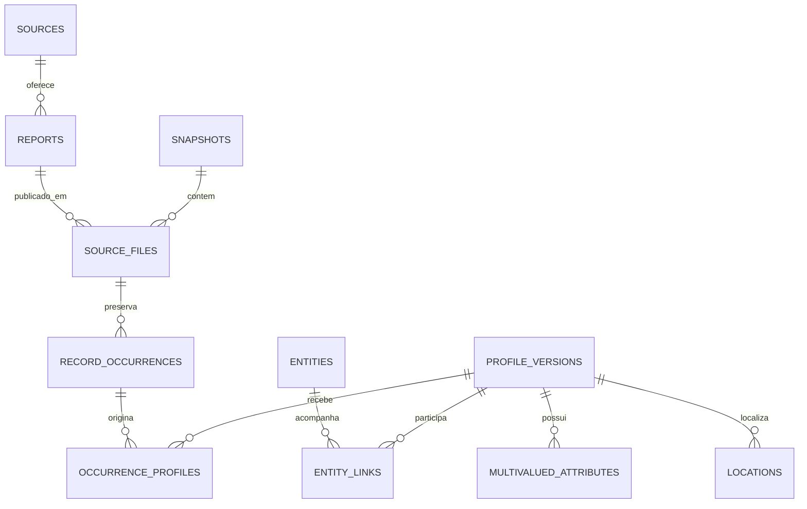

# Modelo canônico relacional — proposta v0.3

Data: 17/09/2026. Estado: especificação conceitual; nenhuma tabela ou migração
foi criada nesta etapa.

## 1. Unidade, origem e persistência

A unidade inicial é o perfil cadastral observado nas fontes oficiais.
`entity_id` identifica continuidade desse perfil ao longo das observações;
não identifica automaticamente um estabelecimento físico único.

Os snapshots brutos permanecem a fonte primária. SQLite poderá materializar o
modelo relacional, mas será integralmente reconstruível a partir desses
snapshots e dos insumos declarativos versionados que definem a transformação.
Parquet será o formato preferencial dos produtos analíticos. SQLite não será
fonte exclusiva de atributos, decisões ou histórico necessários à reprodução.

Há uma distinção necessária: decisões humanas de correspondência não podem
ser deduzidas dos arquivos oficiais. Quando existirem, serão preservadas fora
do SQLite em um registro declarativo versionado de proveniência e entrarão
explicitamente na reconstrução. Sem esse registro, será reconstruído o estado
automático, com vínculos não comprovados pendentes, e não uma falsa reprodução
das decisões anteriores.

## 2. Estruturas conceituais e relações

Os nomes abaixo organizam responsabilidades. Não constituem DDL ou nova API.

| Estrutura | Chave/conteúdo mínimo | Relações e finalidade |
|---|---|---|
| `sources` | Identificador, parceiro, papel, atribuição | Identifica fornecedores e fontes auxiliares |
| `reports` | Identificador estável, fonte, formato, contrato | Um relatório mantém identidade entre snapshots e mudanças de URL |
| `snapshots` | Identificador, estado, datas conhecidas e base temporal | Agrupa uma captura; não inventa data oficial de atualização |
| `source_files` | Snapshot, relatório, formato, caminho relativo, hash, contagem | Preserva integridade e localização portátil |
| `record_occurrences` | Arquivo, posição original, hash de conteúdo | Conserva cada ocorrência, incluindo repetições exatas |
| `profile_versions` | Identificador de versão, conteúdo tipado, regra de transformação | Representa o conteúdo normalizado de um perfil |
| `occurrence_profiles` | Ocorrência, versão, regra e estado da associação | Mantém linhagem sem multiplicar perfis pela sobreposição de relatórios |
| `entities` | `entity_id`, natureza de perfil cadastral | Representa continuidade longitudinal |
| `entity_links` | Entidade, versão/observação, método, estado, justificativa | Registra vínculo confirmado, candidato ou pendente |
| Associações multivaloradas | Versão/ocorrência, atributo, item, proveniência | Subcategorias, qualificações, certificados, atividades e polos |
| `locations` | Coordenadas originais e origem; eventuais derivadas separadas | Mantém localização sem sobrescrever o valor oficial |
| Avaliações de qualidade | Registro/arquivo, regra, versão, estado, motivo | Distingue observação bruta de avaliação derivada |
| Diferenças entre snapshots | Par de snapshots, alvo, tipo de mudança, evidência | Sustenta diff de conteúdo, esquema e vínculos |
| Execuções e artefatos | Entradas, parâmetros, código, ambiente e hashes | Vincula produtos científicos às condições de produção |

Associações ambíguas entre relatórios são registradas como candidatas. Elas não
autorizam copiar o atributo de um registro temático para todos os candidatos.

## 3. Identificadores e temporalidade

- Preservar os `equipment_id` e `record_version_id` da v0.2 numa visão legada;
  não reinterpretar esses campos como identificadores oficiais permanentes.
- Separar identificador de ocorrência, hash de conteúdo, versão normalizada e
  entidade. Conteúdo igual pode aparecer em vários arquivos e datas.
- Preservar o hash dos bytes do arquivo e distinguir hash de payload de hash
  semântico. Mudança de ordem só será ignorada quando o contrato do campo
  declarar que ela não tem significado; listas não serão ordenadas indiscriminadamente.
- Exigir correspondência inequívoca e auditável para continuidade automática.
  Igualdade de nome/endereço ou chave auxiliar, sozinha, não prova identidade.
- Manter candidatos múltiplos pendentes; decisões revisadas precisam ser
  reversíveis e reconstruíveis pelo registro declarativo.
- Datas de coleta, observação, publicação e auditoria são conceitos diferentes.
  Uma data desconhecida permanece desconhecida.
- `first_seen`/`last_seen`, se materializados, significam primeira/última
  observação no acervo disponível, não abertura/fechamento de atividade.

O snapshot atual contém chaves auxiliares ambíguas. A primeira carga da v0.3
deve preservá-las para revisão, sem resolver a ambiguidade por deduplicação
agressiva ou prioridade arbitrária entre candidatos.

## 4. Atributos oficiais, derivados e valores ausentes

Cada atributo promovido precisa informar campo e relatório de origem, snapshot,
ocorrência, transformação e natureza: oficial, normalizado ou derivado.

| Família | Representação proposta |
|---|---|
| Nome, categoria, fonte e localização textual | Valor original preservado e forma normalizada documentada |
| Subcategorias, qualificações, certificados, atividades e polos | Relações multivaloradas, sem perda pelo achatamento em texto |
| Agricultura familiar, DAP, acessibilidade declarada | Valor declarado com ausência explícita; ausência não é `FALSE` |
| Área e área cultivada | Texto/faixa original, categoria e limites quando inequívocos; nenhum ponto médio automático |
| Ano de início | Valor original e ano interpretado quando válido; não usar como data de identidade cadastral |
| Funcionamento | Texto original; disponibilidade por hora somente com interpretação validada |
| Conexões e onde comprar | Itens textuais com proveniência; vínculos a entidades apenas quando resolvidos |
| Grupos analíticos | Classificação derivada, multirrótulo, com versão da regra |
| Distâncias, rotas e descritores | Produtos derivados vinculados à execução e ao grafo |

Registrar separadamente campo ausente do esquema, nulo, string vazia, sentinela
de ausência, valor inválido e não aplicável. Esse tratamento precede a análise
de completude. A ausência estrutural de latitude num relatório temático não deve
substituir uma coordenada oficial existente na base de referência.

O dicionário versionado definirá aliases conhecidos, unidades, tipos, domínios,
cardinalidade, sentinelas e regras de publicação. Campos novos não serão
descartados: permanecerão preservados e identificados no bruto até mapeamento.

Contatos permanecem excluídos dos produtos analíticos públicos. Texto livre e
atributos pessoais não serão publicados automaticamente por terem sido
normalizados. Preservar separação entre uso científico autorizado e exportação.

## 5. Localização e elegibilidade

`has_coordinates` indicará presença do par de coordenadas originais após
reconhecer sentinelas de ausência. Presença não garante validade, precisão,
pertença ao território ou conectividade. Valores preenchidos porém inválidos
terão sua presença e seu problema registrados separadamente.

Validade, elegibilidade e roteabilidade serão avaliações versionadas. Uma
coordenada derivada, se futuramente autorizada, ocupará campos próprios com
provedor, data e qualidade; não apagará a ausência da coordenada original.

O modelo preservará perfis sem coordenadas. Eles participarão de inventário,
qualidade e exploração tabular, mesmo sem contribuir para distâncias ou mapas
de pontos. Nenhuma localização será imputada automaticamente.

## 6. Conciliação e snapshot diff

A base completa será referência dos campos comuns. Valores temáticos adicionais
serão incorporados somente quando sua associação for justificável; conflitos
serão explícitos. Pertencer a vários relatórios não cria várias oportunidades
na visão compatível, nem transforma relatórios em conjuntos disjuntos.

O diff oferecerá duas perspectivas: mudanças observadas no conteúdo dos arquivos
e mudanças em perfis cuja continuidade foi confirmada. Categorias de saída:

- conteúdo incluído, ausente ou inalterado;
- alteração de atributos ou coordenadas em perfil vinculado;
- mudança de presença em relatórios;
- mudança de esquema/representação;
- reaparecimento observado;
- correspondência pendente, com candidatos e motivo.

Não inferir nascimento, encerramento, deslocamento físico ou fusão de
estabelecimentos a partir de mudança cadastral sem evidência adicional.

## 7. Reconstrução, publicação e compatibilidade

A reconstrução deve funcionar sem o SQLite anterior: validar brutos e hashes,
aplicar contratos versionados, reconstruir ocorrências e versões, reaplicar
decisões declarativas disponíveis e gerar avaliações e produtos. Insumos OSM,
IBGE e CEP também serão snapshots locais quando necessários ao produto.

A equivalência será avaliada pelo conteúdo lógico ordenado e pelos manifestos,
não pela igualdade binária do arquivo SQLite ou de metadados voláteis.
Produtos analíticos usarão Parquet preferencialmente, com esquema versionado.

A visão compatível fornecerá os mesmos perfis e identificadores legados à
v0.2. A migração será aditiva; promoção de nova versão ocorrerá apenas após
validação e permitirá retorno ao manifesto anterior sem modificar os brutos.

Critérios: [V0.3_ACCEPTANCE_CRITERIA.md](../migration/V0.3_ACCEPTANCE_CRITERIA.md).
