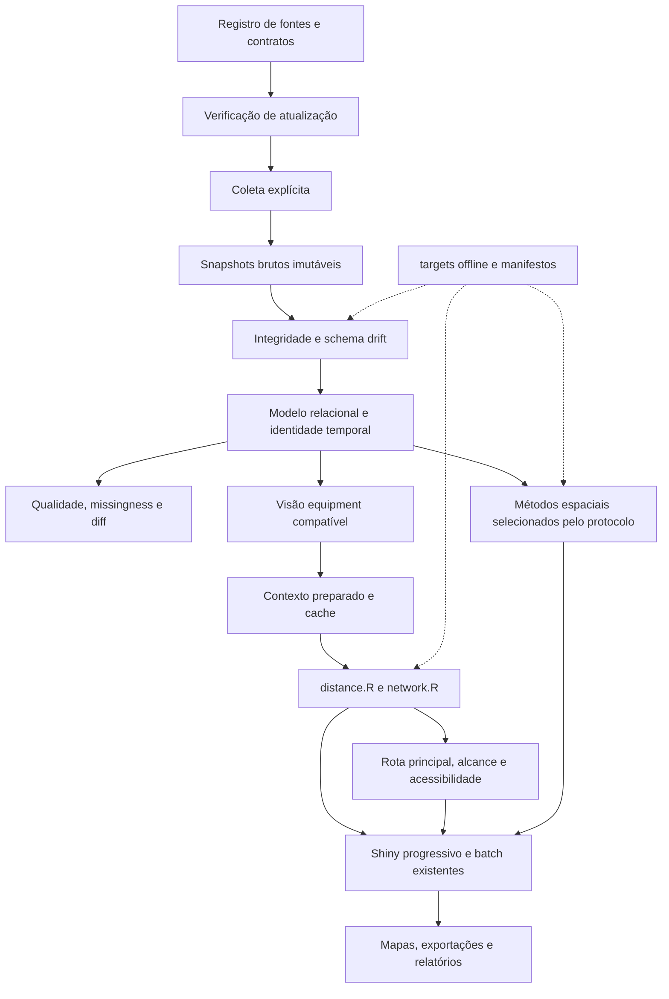

# Arquitetura proposta — SampaMaisAgro v0.3

Data: 17/09/2026. Estado: plano aprovado para evolução incremental; implementação
não iniciada por esta etapa de documentação.

## 1. Decisões e invariantes

1. Evoluir o pacote R e a aplicação Shiny existentes. Preservar execução offline,
   os 14 relatórios, snapshots, validação real, `distance.R`, `network.R`,
   `web-jobs.R`, processamento progressivo, batch, relatórios e testes atuais.
2. A arquitetura oferece modalidades simetricamente. A modalidade científica
   principal será definida posteriormente pelo protocolo de pesquisa.
3. Fontes brutas são imutáveis. Todo produto derivado informa suas entradas e
   as versões das regras que o produziram.
4. SQLite pode materializar o modelo canônico relacional; não será a única
   cópia de informação necessária à reconstrução. Parquet permanece o formato
   preferencial dos produtos analíticos.
5. `entity_id` representa inicialmente continuidade de perfil cadastral.
   Estabelecimento físico único não é uma equivalência presumida.
6. Seleção existente por raio OU top-k permanece compatível. Novas medidas de
   acessibilidade usam custos e denominadores próprios, explicitamente definidos.
7. Alcançabilidade é determinada pelos custos de rede. Polígonos de isócrona
   são produtos cartográficos, não o mecanismo principal de seleção de oportunidades.
8. A primeira versão do engine de rotas reconstrói a rota principal para
   `shortest` e `fastest`. Rotas alternativas ficam fora dessa versão.
9. Métodos científicos candidatos não são análises ativadas automaticamente.
   Sua escolha e interpretação dependem do protocolo e da qualidade dos insumos.

## 2. Camadas propostas

### Registro, atualização e coleta

O registry identificará catálogo, cada um dos 14 relatórios, OSM, IBGE e fonte
de CEP. Incluirá URLs, formatos, parceiro, atribuição, papel analítico, contratos
de esquema e política explícita de coleta. Quantidade atual de relatórios será
uma referência verificada; mudanças do catálogo serão detectadas e registradas.

Verificar atualização e coletar serão operações distintas. A verificação usará
metadados HTTP quando suportados e validadores persistidos por recurso entre
snapshots. Não haverá fallback obrigatório para GET completo. Sem evidência
suficiente, o estado será indeterminado. Um validador alterado indica possível
mudança; o hash após coleta confirma alteração de conteúdo.

O contrato será específico por relatório/formato. Drift avaliará nomes, tipos
observados, listas, domínios, sentinelas e compatibilidade dos campos necessários.
Relatório vazio preserva o esquema declarado/conhecido. Mudança incompatível
impede promover a nova versão processada, sem remover a versão funcional.

### Camada canônica e temporal

O [modelo canônico](CANONICAL_DATA_MODEL.md) separa arquivos, ocorrências,
versões de perfil, associações, localizações, entidades e decisões de
correspondência. A base completa continua referência dos campos comuns; os
temáticos podem oferecer atributos próprios sem sobrescrever conflitos.

A visão `equipment` permanece disponível aos consumidores existentes, com IDs
legados e formatos compatíveis. Adições de colunas não mudarão silenciosamente
a unidade de análise ou os perfis incluídos.

Snapshot diff distingue mudança de conteúdo, mudança de esquema, ausência em
um snapshot e mudança numa entidade vinculada. Nenhuma ausência será traduzida
automaticamente como encerramento de atividade.

### Qualidade, população de referência e missingness

Manter separadas a base completa, a base filtrada pela consulta, o subconjunto
elegível e os pares roteáveis/selecionados. O relatório de qualidade terá
denominador anterior à exclusão espacial, fixado no início da consulta.

Disponibilidade de coordenadas terá `has_coordinates`, análise estratificada e
modelo logístico exploratório candidato. Não haverá diagnóstico automático de
MAR/MNAR; IPW poderá ser considerado apenas em sensibilidade. Os contratos
científicos estão em [SCIENTIFIC_METHODS.md](SCIENTIFIC_METHODS.md).

### Contexto preparado e desempenho

Preparar classificação, elegibilidade, limite, coordenadas projetadas, vértices
e snapping dos destinos uma vez por combinação relevante de versões. O cache
identificará grafo, modalidade, coordenadas e algoritmo; limiares de snapping
continuarão explícitos na avaliação.

Origens potencialmente sensíveis terão cache restrito à execução por padrão.
Manter uma rede por vez no fluxo progressivo. Otimizar reuso antes de introduzir
concorrência que multiplique memória. Partições novas serão consumidas de forma
incremental, sem reler sempre o histórico inteiro.

Separar etapas internas geométricas e de rede mantendo `calculate_proximity()`
compatível. Preservar avaliação de todos os destinos elegíveis. Qualquer poda
futura exige prova de equivalência, especialmente para fastest.

### Rota principal e alcance

Reconstruir trajetos sob demanda para pares escolhidos, com arestas ordenadas,
sentido, objetivo, custo, versão do grafo e conectores separados. As duas
funções de custo, shortest e fastest, precisam ser validadas antes de ampliar
o engine. Não haverá busca de rotas alternativas nessa primeira versão.

Os descritores candidatos e suas condições estão no documento de métodos.
Seu cálculo não transforma atributos incompletos do OSM em auditoria de
segurança, acessibilidade física ou qualidade do trajeto.

Há uma restrição de integração: a documentação consultada de `dodgr_isochrones()`
exige grafos `sc`, enquanto o projeto constrói grafos a partir de `sf`.
A implementação futura deverá verificar o contrato da versão fixada. O caminho
compatível previsto é calcular custos temporais com `dodgr_times()` e construir
produtos cartográficos separados sobre o alcance observado no grafo existente.
Uma eventual rede `sc` seria artefato separado, nunca substituição automática
dos grafos atuais. Não se deve apenas alterar a classe para contornar validação.

`dodgr_isodists()` e `dodgr_paths()` são oportunidades de integração, sujeitas
a testes de equivalência. Caminhos fastest exigem custo temporal explícito;
a interface de paths não deve ser presumida idêntica à de dists.
Referências: [paths](https://urbananalyst.github.io/dodgr/reference/dodgr_paths.html),
[isodists](https://urbananalyst.github.io/dodgr/reference/dodgr_isodists.html),
[isochrones](https://urbananalyst.github.io/dodgr/reference/dodgr_isochrones.html).

### Consumidores, proveniência e compatibilidade

Shiny, batch e relatórios continuarão usando o motor comum. Etapas opcionais
pesadas serão progressivas e canceláveis. Exportações parciais manterão estado
de execução e denominadores; não representarão ausência de oportunidades.

Metadados científicos não dependerão apenas de atributos R. Cada execução
registrará snapshots, grafo, limite, geocodificação, parâmetros, filtros,
unidade analítica, regras, código e ambiente. Diagnósticos distinguirão origem,
métrica, modalidade, objetivo, direção e estado de roteamento.

### Reprodução offline, publicação e CI

`targets` partirá de arquivos locais fixados, com dependências explícitas.
Coleta será externa ao pipeline offline. Reconstrução exigirá previamente as
dependências e os snapshots auxiliares necessários, sem download implícito.

Produtos serão publicados em versões completas. A promoção de um manifesto
ativo ocorrerá após validação; uma falha deixará a versão anterior disponível.
RDS/CSV/JSON continuarão atendendo compatibilidade, enquanto Parquet será
preferencial para novos produtos analíticos.

CI será introduzida na Fase 0, com fixtures pequenas, pacote instalado,
verificações offline e regressões da interface. Validação real continuará em
ambiente preparado, com evidências vinculadas às versões. O lockfile não
substitui registro das bibliotecas de sistema e ferramentas de relatório.

## 3. Limites desta formalização

Nenhum módulo, API, migração SQL, teste ou workflow está sendo implementado.
Nomes de estruturas neste conjunto documental são contratos conceituais,
não promessa de símbolos já exportados.

Não se introduzem automaticamente população, renda, capacidade ou demanda,
geocodificação de equipamentos ausentes, inferência causal, modalidade principal
ou rotas alternativas. A arquitetura deverá permitir evolução posterior sob
protocolo, sem inventar essas informações.

Execução futura segue [V0.3_PLAN.md](../migration/V0.3_PLAN.md),
[critérios de aceitação](../migration/V0.3_ACCEPTANCE_CRITERIA.md) e
[riscos](../migration/V0.3_RISKS.md).
